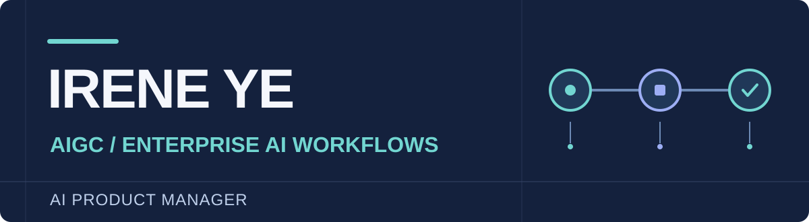

### Hi, I'm Irene (Yiran) Ye.

I'm an **AI Product Manager focused on AIGC and enterprise AI workflows**. I turn open-ended AI capabilities into structured products that help people complete real work—where reliability, user control, and business value matter as much as model quality.

My path started in design and has grown into **4+ years building AI products** across creative tools, generative media, and desktop agents.

[**Portfolio & case studies →**](https://yiranye.vercel.app) &nbsp;·&nbsp; [LinkedIn](https://www.linkedin.com/in/yiranye08/) &nbsp;·&nbsp; [Email](mailto:08ireneye@gmail.com)

---

### Where I've applied this thinking

- **Enterprise AI workflows · [Cortex AI](https://withcortex.ai)** — As Founding Product Manager, I work on a desktop AI agent for productivity: agent evaluation, first-task activation, recovery flows, and connected tool workflows.
- **AIGC for commerce · Onceness** — I led 0→1 product work on AI video generation for small businesses, shaping a guided path from vague creative intent to usable output.
- **Creative AI at work · 5+Design** — I helped build an internal image-generation workflow for design teams, connecting model capabilities to a repeatable creative process.

### Explore the work

- [**Worlding AI product case study**](https://yiranye.vercel.app/ai-product-launch) — A product exploration of computer-vision-assisted ad creation, from user flow to acceptance criteria.
- [**LegalGuard**](https://github.com/IreneYe08/LegalGuard) — A privacy-minded Chrome extension prototype that makes online terms easier to understand.
- [**file-organization**](https://github.com/IreneYe08/file-organization) — A reusable agent skill for organizing files and keeping workspaces maintainable.

**My product lens:** user intent → task design → model and tool orchestration → evaluation → a usable outcome.

If you're building AI that needs to work beyond the demo, [let's connect](https://www.linkedin.com/in/yiranye08/).
